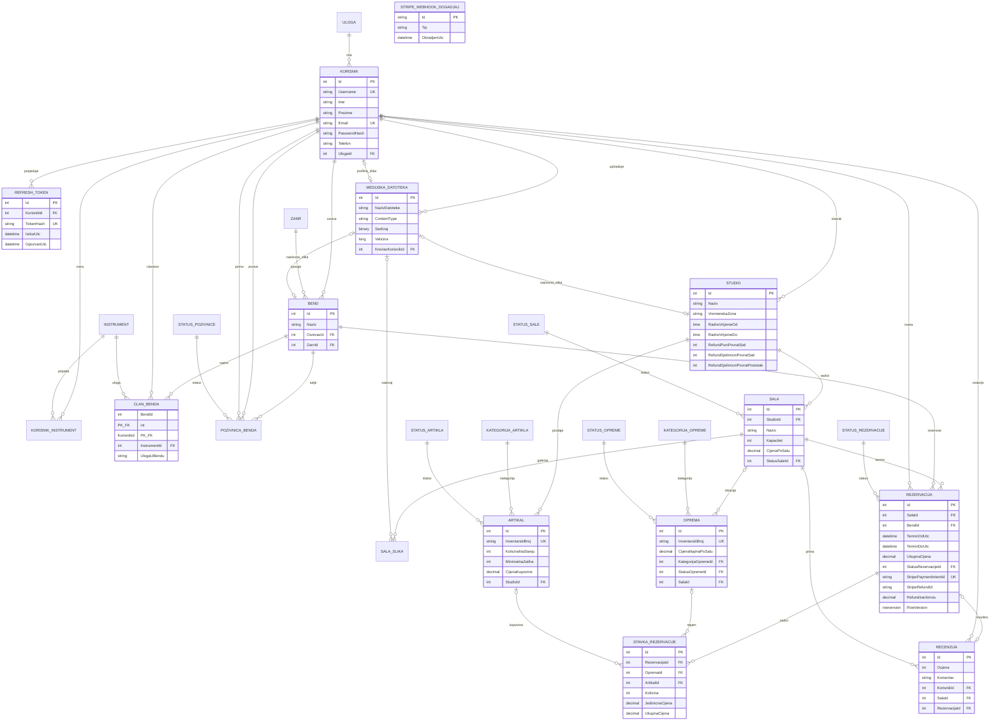

# OpenAmp ERD — Faze 1–3

## Pravila integriteta

- `ClanBenda` i `KorisnikInstrument` koriste kompozitne primarne ključeve.
- Svaka stavka rezervacije referencira tačno jedan tip: `Oprema` ili `Artikal`.
- Ocjena recenzije je ograničena na raspon 1–5.
- `TerminDoUtc` mora biti nakon `TerminOdUtc`.
- `Rezervacija.RowVersion` je SQL Server `rowversion` concurrency token.
- Indeks `IX_Rezervacije_Sala_Termin` podržava atomsku provjeru preklapanja termina.
- Hash refresh tokena je jedinstven i stvarni token se nikada ne čuva u bazi.
- Username je normalizovan na mala slova i jedinstven; pozivnice za bend vežu se za postojećeg korisnika.
- JPEG, PNG i WebP slike do 5 MB čuvaju se u `MedijskeDatoteke`.
- ID Stripe webhook događaja je primarni ključ za idempotentnu obradu.
